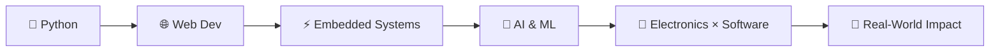

<!-- ===================== HEADER ===================== -->

  

  

 

<!-- ===================== ABOUT ===================== -->
## 👋 About Me

I'm **Govind**, an **Electronics & Communication Engineering** student at
**Lovely Professional University**. I like working where **hardware meets
software**: wiring up sensors, writing code for them, and turning ideas into
projects that do something useful.

| | |
|:--|:--|
| 🎓 **Studying** | Electronics & Communication Engineering |
| 🔭 **Exploring** | Embedded systems, wireless communication, AI |
| 🌱 **Learning** | Python, Web Development (HTML / CSS / JS) |
| 🛠️ **Building** | Real-world projects that solve real problems |

 

<!-- ===================== TECH STACK ===================== -->
## 🧰 Tech Stack

### 💻 Programming & Web

  

### ⚡ Electronics & Embedded

  
  
  
  

### 🔧 Tools

  
  

 

<!-- ===================== PROJECTS ===================== -->
## 🚀 Featured Projects

<table>
  <tr>
    <td width="33%" valign="top">
      <h3>🩸 BloodBridge</h3>
      <b>Blood Donor Matching System</b>
        
      A Python project with a humanitarian use case: organizing donor
      information and finding potentially suitable donors for simulated
      blood requests.
        
      
      
      
    </td>
    <td width="33%" valign="top">
      <h3>🌊 Flood Detection</h3>
      <b>ESP8266 Water Level Monitoring</b>
        
      Hardware + software system that monitors water levels using ultrasonic
      sensors and sends the data wirelessly with ESP-NOW.
        
      
      
      
    </td>
    <td width="33%" valign="top">
      <h3>🌐 Portfolio</h3>
      <b>Developer & ECE Website</b>
        
      A personal site showcasing my education, skills, projects,
      achievements, hobbies and learning journey.
        
      
      
      
    </td>
  </tr>
</table>

 

<!-- ===================== ROADMAP ===================== -->
## 🗺️ Roadmap

My long-term goal is to combine **ECE + Software + AI** to build systems
that solve meaningful real-world problems.

 

<!-- ===================== LEARNING JOURNEY ===================== -->
## 🌱 Learning Journey

> My own self-assessment. It updates as I grow.

| Skill | Progress | Stage |
|:--|:--|:--|
| 🐍 Python |  | Building projects |
| 🌐 Web (HTML/CSS/JS) |  | Learning |
| ⚡ Embedded Systems |  | Building projects |
| 📡 Wireless (ESP-NOW) |  | Learning |
| 🤖 AI & ML |  | Just starting |

<!--
## 🔨 Currently Building
- 🚧 **[PROJECT NAME]**: [one line on what it is]
  → [repo link]
(Remove the comment markers around this block when you have something to add.)
-->

 

<!-- ===================== FOCUS ===================== -->
## 🎯 Current Focus

| Area | What I'm working on |
|:--|:--|
| 🐍 **Python** | Programming & project development |
| 🌐 **Web** | HTML, CSS & JavaScript |
| ⚡ **Electronics** | Embedded systems & sensors |
| 📡 **Communication** | ESP8266 & wireless systems |
| 🤖 **AI** | Intelligent systems & fundamentals |
| 🔧 **Workflow** | Git, GitHub & project management |

<b>📚 What I'm learning through projects</b>

 

- Programming fundamentals
- Data structures & logical thinking
- Python application development
- Web development
- Electronics & embedded systems
- Sensors and microcontrollers
- Wireless communication
- Git & GitHub
- Problem solving

<b>🏁 Goals</b>

 

- [ ] Become strong in Python
- [ ] Build practical web-development skills
- [ ] Get better at embedded systems
- [ ] Build more advanced electronics projects
- [ ] Explore AI and Machine Learning
- [ ] Combine electronics with software
- [ ] Ship meaningful real-world projects

 

<!-- ===================== GITHUB STATS ===================== -->
## 📊 GitHub Stats

### 🐍 Contribution Journey

 

<!-- ===================== CONNECT ===================== -->

 

## 🤝 Let's Connect

  

&nbsp;

&nbsp;

  

<table>
  <tr>
    <td align="center">💼 <b>Collaborate</b> on projects</td>
    <td align="center">🧠 <b>Learn</b> together</td>
    <td align="center">⚡ <b>Build</b> real things</td>
  </tr>
</table>

 

**⚡ BUILD • LEARN • EXPERIMENT • REPEAT ⚡**

Thanks for visiting my profile!

